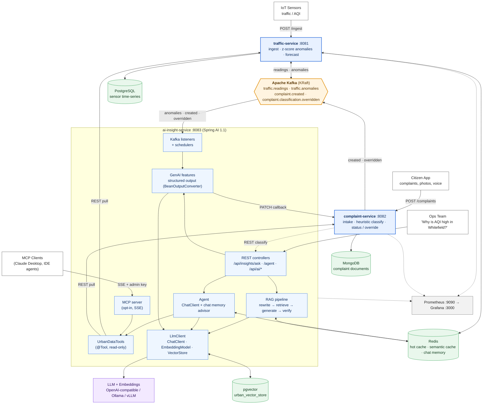
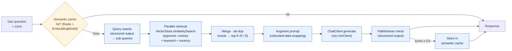
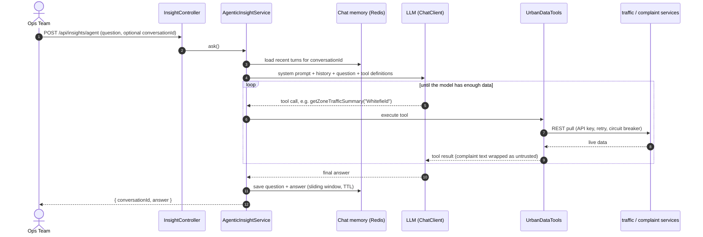
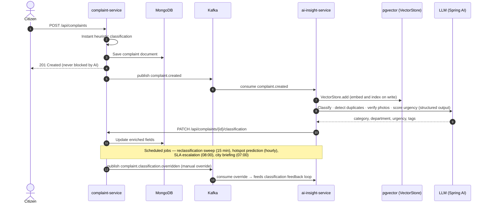

# Urban Insights Platform

A data engineering reference architecture for **urban civic problems** (traffic congestion,
air quality, citizen complaints) built as **Java Spring Boot microservices**, combining:

| Concern | Technology | Why |
|---|---|---|
| Structured, high-volume time-series data | **PostgreSQL** | Sensor readings, indexed by sensor/zone/time, needs SQL aggregates (AVG/STDDEV) for anomaly detection |
| Hot, low-latency reads | **Redis** | Dashboard "latest reading per sensor" served in sub-ms; short-TTL cache-aside + cache-put pattern |
| Flexible, unstructured/semi-structured data | **MongoDB** | Citizen complaints vary wildly in shape (photos, free text, geo, tags) — document model over rigid tables |
| Statistical/ML scoring | **AI module** | Lightweight z-score anomaly detector in `traffic-service` (stand-in for a trained model) |
| Natural-language reasoning | **GenAI / LLM** | Spring AI `ChatClient` (OpenAI-compatible; swappable for a local model via Ollama/vLLM) |
| Grounded answers over live data | **RAG** | `ai-insight-service` retrieves fresh data from the other two services, embeds it, and grounds the LLM's answer in it |
| Orchestration, tools, memory | **Spring AI** | `RagInsightService` implements the RAG chain; `AgenticInsightService` adds tool calling and chat memory; `UrbanDataTools` can also be served over MCP |

## Application Stack

| Layer | Technology | Version | Used for |
|---|---|---|---|
| **Language / build** | Java | 17 | All three services |
| | Maven (multi-module) | 3.9 (Docker build image) | Root `pom.xml` + `traffic-service`, `complaint-service`, `ai-insight-service` |
| | Lombok | managed by Boot | Boilerplate reduction (DTOs, constructors, loggers) |
| **Application framework** | Spring Boot | 3.5.15 | Web (MVC), Actuator, Validation, AOP, scheduling |
| | Spring WebFlux `WebClient` | managed by Boot | Inter-service REST calls (`UrbanDataClient`, `AiInsightClient`), webhook delivery |
| **GenAI / RAG** | **Spring AI** | 1.1.8 (BOM) | `ChatClient`, `EmbeddingModel`, `VectorStore`, tool calling, advisors, chat memory, MCP server |
| | `spring-ai-starter-model-openai` | 1.1.8 | Chat + embeddings against any OpenAI-compatible endpoint (OpenAI, Ollama, vLLM); `gpt-4o-mini` and `text-embedding-3-small` by default |
| | `spring-ai-starter-vector-store-pgvector` | 1.1.8 | Persistent RAG index (HNSW, cosine, 1536-dim) |
| | `spring-ai-starter-mcp-server-webmvc` | 1.1.8 | Opt-in MCP server (SSE) exposing city data as tools |
| **Relational data** | PostgreSQL + pgvector | `pgvector/pgvector:pg16` | Sensor time-series (`traffic-service`, Spring Data JPA / Hibernate) and the vector index (`ai-insight-service`) |
| **Document data** | MongoDB | 7 | Citizen complaints, `2dsphere` geo index (`complaint-service`, Spring Data MongoDB) |
| **Cache / state** | Redis | 7 (alpine) | Latest-reading cache and rolling windows, semantic answer cache, SLA de-dup, city briefing, classification-feedback exemplars, chat memory, distributed rate limiting |
| **Messaging** | Apache Kafka (KRaft, single broker) | 3.7 (`bitnami/kafka`) | Event backbone, via Spring Kafka |
| **Resilience** | Resilience4j | 2.2.0 | Retry + circuit breaker on inter-service calls |
| **Security** | Shared-secret `X-API-Key` filter | in-house | Two tiers (public / admin) on every service; MCP endpoints admin-only |
| **Observability** | Micrometer + Prometheus | Prometheus `v2.53.0` | Service metrics, `urban.llm.call` latency, plus Spring AI's built-in model-call metrics |
| | Grafana | `11.1.0` | Auto-provisioned "LLM Cost & Latency" dashboard |
| **Packaging / runtime** | Docker, Docker Compose | `eclipse-temurin:17-jre-alpine` | One-command local stack (`docker compose up`) |
| **Testing** | JUnit 5, Mockito (`spring-boot-starter-test`) | managed by Boot | Unit tests in each service |

> **Version note:** Spring AI 1.1.x is built for Spring Boot 3.5, so moving off LangChain4j also moved the project from Boot 3.3.2 to 3.5.15. Spring AI 2.0 (GA June 2026) requires Spring Boot 4; this project stays on the 1.1 line.

### Spring AI in this project

| Capability | Spring AI abstraction | Where it lives |
|---|---|---|
| Chat model access, metrics, error handling | `ChatClient` | `llm/LlmClient` (single entry point for every LLM call) |
| Structured output (typed JSON → records) | `BeanOutputConverter` | `ComplaintClassificationService`, `SentimentUrgencyService`, `LanguageSupportService`, `PhotoVerificationService`, `QueryRewriteService`, `FaithfulnessChecker` |
| Embeddings | `EmbeddingModel` | `SemanticCacheService`; implicitly inside `VectorStore` |
| Vector search / persistent index | `VectorStore` (pgvector; `SimpleVectorStore` fallback) | `UrbanDataRetriever`, `config/AiConfig` |
| Multimodal input | `UserMessage` + `Media` | `PhotoVerificationService` |
| Tool calling | `@Tool` / `@ToolParam` | `tools/UrbanDataTools` |
| Multi-turn memory | `MessageChatMemoryAdvisor`, `MessageWindowChatMemory`, custom Redis `ChatMemoryRepository` | `service/AgenticInsightService`, `memory/RedisChatMemoryRepository` |
| MCP server | `ToolCallbackProvider` + MCP starter | `config/McpServerConfig` |

**Try the agentic endpoint** (the model decides which live-data tools to call; reuse `conversationId` for follow-ups):

```bash
curl -s -X POST http://localhost:8083/api/insights/agent \
  -H "X-API-Key: $INTERNAL_ADMIN_API_KEY" -H "Content-Type: application/json" \
  -d '{"question": "Is AQI unusual in Whitefield, and are there related complaints?"}'
# -> {"conversationId":"...","answer":"..."}
```

**Enable the MCP server** (off by default; requires the admin key on every request):

```bash
MCP_SERVER_ENABLED=true docker compose up -d --build ai-insight-service
# MCP clients connect to http://localhost:8083/sse
```

**Use a local model instead of OpenAI:** set `OPENAI_BASE_URL` to the OpenAI-compatible endpoint **including `/v1`** (for example `http://host.docker.internal:11434/v1` for Ollama) and `OPENAI_MODEL` to the model name. The embedding model name is `spring.ai.openai.embedding.options.model`; if you change it, also change `spring.ai.vectorstore.pgvector.dimensions` to match.

**Migrating an existing database:** the vector index now lives in a new table, `urban_vector_store`, created automatically on first start. The old LangChain4j table `urban_embeddings` is unused and can be dropped. Embeddings are rebuilt as new complaints and anomalies arrive; `rag.index-on-query-fallback=true` re-indexes a zone on demand. On a database created before this change, run `CREATE EXTENSION IF NOT EXISTS hstore; CREATE EXTENSION IF NOT EXISTS "uuid-ossp";` once as a superuser (new databases get this from `infra/postgres-init/001-pgvector.sql`).

## Architecture

### 1. System Architecture



### 2. RAG Pipeline (`/api/insights/ask`)



### 3. Agentic Query: Tool Calling + Chat Memory (`/api/insights/agent`)



### 4. Complaint Lifecycle (event-driven enrichment)



### 5. Component Summary

| Component | Port | Role | Stores / Dependencies |
|---|---|---|---|
| `traffic-service` | 8081 | Sensor ingestion, rolling z-score anomaly detection, zone summaries, forecasting | PostgreSQL, Redis, Kafka |
| `complaint-service` | 8082 | Complaint intake, instant heuristic classification, status/override workflow, geo queries | MongoDB, Kafka |
| `ai-insight-service` | 8083 | RAG Q&A, agentic Q&A with tools and memory, GenAI features (classification, duplicates, zone comparison, anomaly explanation, SLA escalation, status chatbot, city briefing, hotspots, photo and voice handling), optional MCP server | pgvector, Redis, Kafka, LLM provider (Spring AI) |
| Kafka | 9092 | Event backbone (`traffic.readings`, `traffic.anomalies`, `complaint.created`, `complaint.classification.overridden`) | — |
| Prometheus / Grafana | 9090 / 3000 | Metrics scraping and the LLM cost and latency dashboard | All three services |

## About This Application and Different from other applications

### About This Application

Urban Insights Platform is a **reference / demo architecture**, not a deployed
production system. It exists to show, in working code, how a city-scale civic
platform can combine three very different data shapes (time-series sensor
readings, freeform citizen complaints, and vector embeddings for
retrieval-augmented generation) behind three cooperating Spring Boot services.

**What it actually does:**

- **`traffic-service`** ingests IoT-style traffic and air-quality-index (AQI)
  sensor readings, persists them to PostgreSQL, keeps a "latest reading per
  sensor" and per-zone summary hot in Redis, and flags statistical anomalies
  (a rolling z-score over each sensor's recent readings) without hitting the
  database on every single reading.
- **`complaint-service`** accepts citizen complaints (garbage, potholes, water
  leakage, etc.) as flexible MongoDB documents — photos, free text, geo-tags,
  and category all vary complaint to complaint, which is why this data lives
  in a document store rather than a rigid relational table. It classifies a
  complaint instantly with a cheap local heuristic so submission never blocks
  or fails because of an AI outage, then republishes the event for
  asynchronous enrichment.
- **`ai-insight-service`** is the GenAI/RAG brain of the platform. It listens
  for new complaints and anomalies, embeds them into a persistent `pgvector`
  index the moment they're written, and answers natural-language questions
  ("Why is AQI high in Whitefield, and are there related complaints?") by
  retrieving the freshest relevant data, grounding an LLM's answer in it, and
  running a faithfulness check before returning that answer. It also offers an agentic mode where the model
  calls live-data tools and keeps multi-turn memory, and can optionally serve those tools over MCP. It also drives
  the higher-level GenAI features layered on top: automatic complaint
  classification, duplicate-complaint detection, multi-zone comparison,
  anomaly explanation, SLA breach detection with drafted escalation notes,
  a citizen-facing "where's my complaint?" chatbot, and a scheduled daily
  city briefing.
- All inter-service calls go through a shared-secret `X-API-Key` (two-tier:
  public vs. admin), wrapped in Resilience4j retries and circuit breakers so
  one service being slow or down degrades gracefully instead of cascading.
- The whole stack — PostgreSQL (with pgvector), MongoDB, Redis, Kafka,
  Prometheus, and Grafana — runs locally with a single `docker compose up`,
  and `seed-data/` can populate it with realistic dummy sensor readings and
  complaints for a demo.

**Who this is for:** engineers who want a concrete, runnable example of
combining polyglot persistence (SQL + document + cache + vector), an
event-driven backbone (Kafka), and a grounded LLM/RAG layer in one coherent
Java codebase — not a finished product ready to serve a real city.

### Different from Other Applications

Most sample or tutorial applications pick a single technology and show it in
isolation — a CRUD app over one database, a standalone chatbot, or a Kafka
"hello world." Urban Insights Platform is different in a few specific ways:

- **Polyglot persistence used for a reason, not for show.** Each data store
  was chosen because of the shape of the data it holds — PostgreSQL for
  structured, aggregate-heavy time-series sensor readings; MongoDB for
  irregularly-shaped citizen complaints; Redis for sub-millisecond hot reads;
  and pgvector for persistent semantic search — rather than routing
  everything through one general-purpose database.
- **The AI layer is grounded, not a bolt-on chatbot.** Instead of a generic
  wrapper around an LLM API, `ai-insight-service` implements a full RAG
  pipeline (query rewriting → hybrid retrieval → reranking → grounded
  generation → a faithfulness check) so answers are tied to live sensor and
  complaint data instead of the model's own unverified output.
- **Event-driven by default, not request/response everywhere.** Sensor
  ingestion and complaint submission both return immediately and do the real
  work (persistence, classification, indexing) asynchronously off Kafka,
  rather than making the caller wait on every downstream step — including the
  slowest ones (LLM/embedding calls).
- **Multiple cooperating services, not one monolith.** `traffic-service`,
  `complaint-service`, and `ai-insight-service` are independently deployable
  Spring Boot applications that call each other over authenticated REST and
  Kafka, exercising patterns (circuit breakers, retries, rate limiting,
  service-to-service auth) that a single-service sample app has no reason to
  demonstrate.
- **Honest about its own gaps.** The codebase and its documentation explicitly
  call out what was deferred (schema-less Kafka payloads, no dead-letter
  topic, single-broker Kafka, hardcoded service URLs, etc.) rather than
  presenting itself as deployment-ready — which is unusual for a reference
  project, but intentional here: it's meant to teach the pattern honestly, not
  to look finished.

